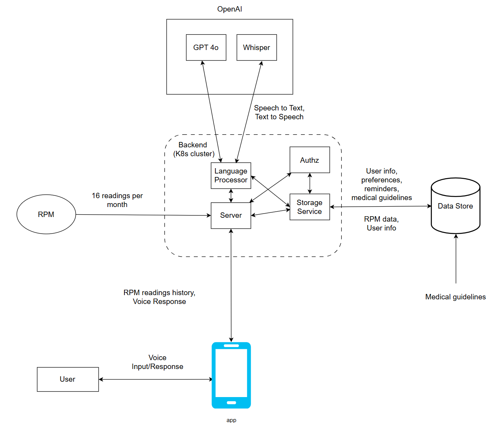

# Senior Sage

The primary objective of this project is to enhance the **Vitalink management app** by developing a voice assistant (VA) specifically tailored for senior users in healthcare management. This voice assistant will collect health-related information through natural, conversational interactions, allowing doctors and researchers to gain insights without making users feel like they are undergoing a medical assessment. The VA will simulate a doctor-patient conversation to help seniors feel more comfortable sharing information about their well-being.

Our aim is to create short, efficient conversations that seamlessly fit into the user’s daily routine, encouraging consistent engagement. These interactions will help gather valuable data on emotions, mood, and general health, which will contribute to ongoing research on chronic conditions such as hypertension and heart failure. While the VA will not track blood pressure directly, it supports Vitalink’s broader goal of promoting healthy habits, such as regular blood pressure checks, by engaging users regularly in a natural way.

## Guidelines to set up and run the project

### React-native application setup
- Install Java, Android Studio, Android SDK, nodejs
    - Checkout this guide from official react-native website for more detailed guide to set up your environment: https://reactnative.dev/docs/set-up-your-environment
    - Additional resource: Microsoft's React Native for Android tutorial
- Clone this project
- Navigate to `app/` dir
- Run `npm install` to install all the dependencies for the project
- Connect your android device to laptop (or use emulators in android studio)
    - Ensure you have enabled debugging mode on your android phone
    - Run `adb devices` and ensure you are seeing your device connected before installing the app
- Run `npx react-native run-android` to build and install the app on your device

### Backend server setup
- Install minikube: [installation](https://minikube.sigs.k8s.io/docs/start/?arch=%2Fwindows%2Fx86-64%2Fstable%2F.exe+download)
- Install helm: [installation](https://helm.sh/docs/intro/install/)
- Build docker images
  - Navigate to [Docker Makefile](./docker/Makefile)
  - Change the `NAMESPACE` var to your docker account username
  - Navigate to [helm values.yaml](./helm/senior-sage/values.yaml)
  - Change `dockerUsername` to your docker username
  - Navigate to `./docker` directory and run `make`
    - This will build all the required images and push it to your docker hub account
- Run minikube: `minikube start`
- Run ingress addon: `minikube addons enable ingress`
- In a new terminal, start minikube dashboard: `minikube dashboard`
- Expose ingress to localhost: `minikube service -n ingress-nginx ingress-nginx-controller`
- Install `senior-sage` project:
  - `cd helm`
  - `helm install senior-sage ./senior-sage/`

## Architecture

- We are leveraging OpenAI APIs for our project. The 2 models that we are using are `GPT 4o mini` and `Whisper`
- We have opted for microservice based architecture with scalability in mind as each service (as shown in the diagram) can be horizontally scaled to meet the growing user base.
- The system is designed to be HIPAA compliant
  - `Storage Service` enforces strict authorization rules for who can access what resources and data 
  - It will also log data access requests (and whether or not it was granted) for auditing purposes
  - Data stored in the Database is completely encrypted and will be decrypted by `Storage Service` on the fly while serving the requests

### Language Processor Service
- This is the brain of the Voice Assistant
- Implemented in Python and leverages OpenAI APIs with prompt engineering to achieve the desired functionalities

### Server
- This is the server that is exposed to outside world for phones to connect to.
- Implemented in Golang

### Authz Service
- This is the Authentication and Authorization service that is responsible for login, signup, authorization services.
- Implemented in Golang

### Storage Service
- Exposes internal APIs for other services to access the Data
- Leveraging the `Authz` service, enforces strict authorization policies for data access control
- Logs data access requests for auditing purposes

### Phone App
- Beautifully designed simple and intuitive cross-platform application built using React-native, keeping in mind the ease of use for senior users

### Data Store
- Currently using MongoDB to store all user data
- Data that is stored in MongoDB is completely encrypted

## Features completed so far (Sprint 1)

- **Speech-to-Text (STT)**: The VA can understand and process user voice commands.
- **Text-to-Speech (TTS)**: Reads out health-related information back to the user in a clear, natural tone.
- **Short, Concise Responses**: Provides brief, accurate responses to user queries.
- **Clarification Handling**: Requests clarification when user input is complex or unclear.
- **Voice Interaction Deletion**: Allows users to delete saved voice interactions to ensure privacy.
- **Backend Setup**: Established the backend architecture to handle voice input processing and data management.
- **App Development Setup**: Initial setup of the app interface and integration with the VA.
- **LLM Integration Testing**: Conducted integration tests for the large language model to ensure accurate conversation flow.
- **User Interaction Logs**: Captures logs of individual user interactions for review and improvement.
- **End-of-Conversation Detection**: Detects when a conversation has naturally ended and disengages to ensure a smooth user experience.

## Features completed so far (Sprint 2)

- **Reminder for appointments**: The user is now able to set reminder for appointments with the help of voice assistant.
- **Reminder for checking BP**: The user can now set reminders for checking his BP with the help of voice assistant.
- **Reminder for medication**: The user can now set reminders for taking medication with the help of voice assistant.
- **Timesense**: The voice assistant now has a sense of what time it was yesterday, what time it is today and it remembers where we last left off our conversation.
- **CI/CD set up**: Completed CI/CD setup leveraging Github Actions. For every pull request raised to main branch, it now triggers workflows to run all tests of the repository.
- **Login & sign up functionality**: `authz` service has been added which now supports user login and signup.
- **Authorization**:  `authz` service also exposes endpoints to be used by `storage` service to check for requesting user permissions before granting access to resources in the database. This is a requirement for HIPAA compliant storage system.

## Features completed so far (Sprint 3)

- **Storing health related questions:** Added the ability to record user responses from the health questionnaire for research purposes.
- **Storing user preferences:** Made the voice assistant smarter by remembering user preferences for personalized interactions.
- **Built in-house knowledge base:** Built a repository of medical references for users to access credible information.
- - **Created a custom RAG model:** Validated responses for our RAG/customized LLM to make sure it gives accurate health-related answers.
- **RPM Insights module:** Generated summaries of RPM data, giving both doctors and patients actionable insights.
- **Role-based control:**Implemented role-based access control to keep things private and HIPAA-compliant.
- **Tesitng Environment Setup:**Set up Minikube to test and deploy Kubernetes locally.
- **Error logging:**Added error logging to help with troubleshooting and improve the system for developers and admins.

## Features completed so far (Sprint 4)

- **Rewards Module:** Implemented the rewards module, allowed users to log their activities when done.
- **Emotion Detection Analysis:** Performed sentiment analysis on the users inputs to generate a mood based report per user, that can help doctor's in their analysis.
- **Login and create user section:** Login screen and create user screen implemented
- **Onboarding section:** Create Account screen, Profile picture screen, Voice selection screen and user details screen implemented
- **Rewards and functionalities section :** Home screen, rewards screen, claim rewards screen, exercise screen, medication screen, reminders screen, streaks screen, tiers screen, vitals screen, voice assistant screen implemented
- **General settings and feedback screen:** Settings screen implemented

### Demos

- Video demonstration of completed features: [Drive Link](https://drive.google.com/file/d/1ehv0SEtEmiVb6_0UlOOfCOUTCsOCESpG/view?usp=sharing)
